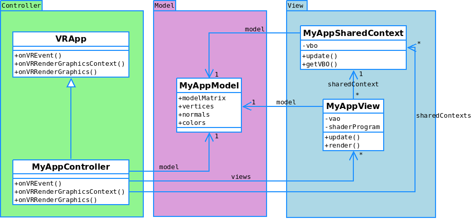

# MinVR OpenGL Multithreaded Tests

This test uses the model view controller pattern to enable multithreading for MinVR.
It also takes advantage of the MinVR_Threading plugin to add the ThreadGroupNode display node.  The
ThreadGroupNode node synchronizes displays at the render, finish rendering, and display 
finished rendering.

## Run the tests

Note: It is necessary to configure the Threading Plugin for building with the following command:

```bash
cmake <src_dir> -DMINVR_THREADING_PLUGIN=ON
```

To execute the multithreaded test program, run the following from the command line:

  ```bash
  # Normal output without multithreading
  build/bin/itest-opengl-multithreaded -c desktop
  # Opens two multithreaded windows
  build/bin/itest-opengl-multithreaded -c desktop-multithreaded
  # Opens four multithreaded windows with one shared context for the vbo
  build/bin/itest-opengl-multithreaded -c ivlabcave-desktop
  ```

### Test Validation

* Normal (desktop) - A user should see a rotating cube in a single window.
* Multithreaded (desktop-multithreaded) - A user should see the same view of a rotating cube in two windows.
* Multithreaded + Shared Context (ivlabcave-desktop) - A user should see four windows each with a different perspective view of a rotating cube.  This test shows an unwrapped cave environment with the left wall, front wall, and right wall on one row.  The floor of the cave is a window under the front wall (in the middle).

## Overview

The following describes how the test works in more detail.  Below is an overview of how the
code relates to the Model View Controller pattern:



### MyAppController
 
The MyAppController essentially is the application.  It handles events, creates and maintains views, and updates the model.  There are two synchronization points in the controller where a developer needs to worry about threading.  The first is when a context is created, and the second is when a context is destroyed.  Since these actions update dictionaries in the controller class, it is necessary to wrap the dictionary updates with a mutex.  Since this happens only on initialize and when the program quits, those are the only two areas in the controller that need synchronization.  The model should be updated when an event happens, which could be a per frame event.  Since the onVREvent() function is part of the main thread, no synchronization is necessary.

### MyAppModel

The MyAppModel class is a simple class that holds application data which can be shared between the controller and the view.  It is editable in the controller, but read-only in the view.  Since it is only edited when events happen, no synchronization is necessary.

### MyAppSharedContext

The MyAppSharedContext is a class that allows windows to share objects with other windows.  In the configuration, a user can specify that they would like a window to share a SharedContextGroupID.  Windows with the same integer value will share the same context, otherwise values of -1 will make a window have its own shared context.  There is a synchronization point in the update() method.  This is because, for this test, only one window will update the shared context at a time.  More advanced options are possible (i.e. multiple windows updating several different shared buffers).  Thetest takes the simplest of these options, and since all the data is loaded when the shared context is created, the update method is not used in the test.

### MyAppView

The MyAppView class manages window specific variables.  For example, although the shared context object can hold a VBO, the window still needs to maintain its own shaders and VAO objects.  The view also controls drawing the scene.  No synchronization is necessary here because each thread renders its own context and the model and shared context are read-only.
