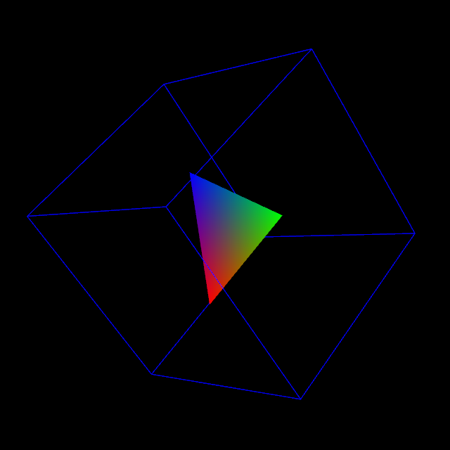

# MinVR Python Tests

This set of tests use the Python specific implementations for MinVR

## Run the tests

To execute the python test programs, run the following from the command line:

  ```
  python cube.py -d /path/to/MinVR/install_or_build_directory -c desktop-oldopengl
  python example2D.py -d /path/to/MinVR/install_or_build_directory -c desktop-oldopengl
  ```
  
## Output

For the cube.py example, it should show a rotating cube with a colored triangle inside:



## Getting Started

Please review the documentation found at [MinVR Python Documentation](../../plugins/Python/README.md).
